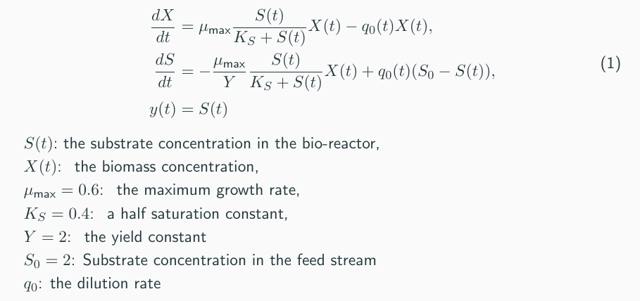
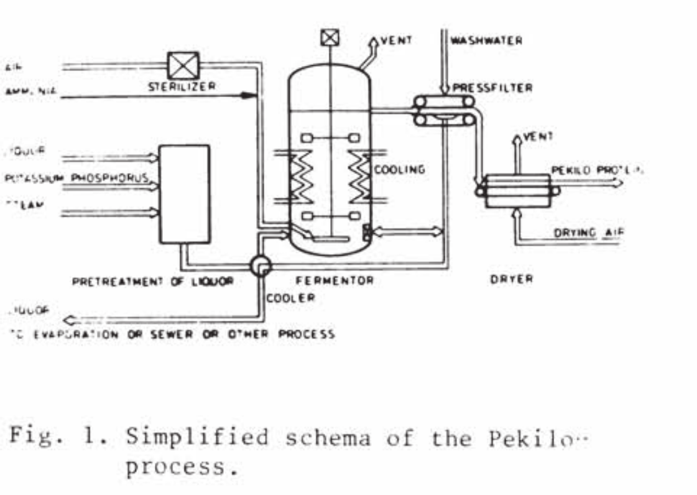
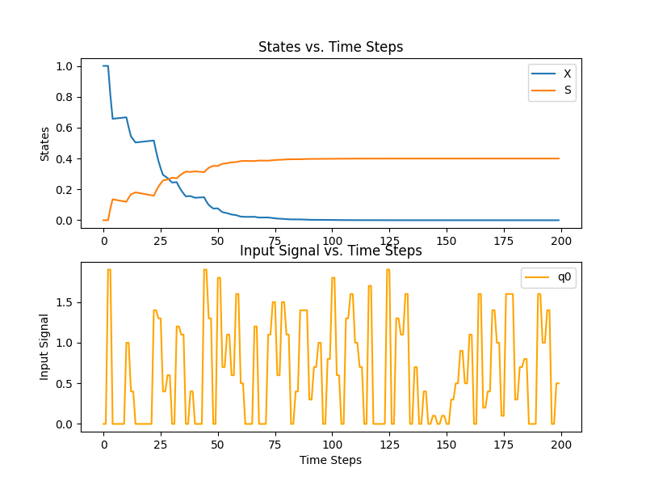
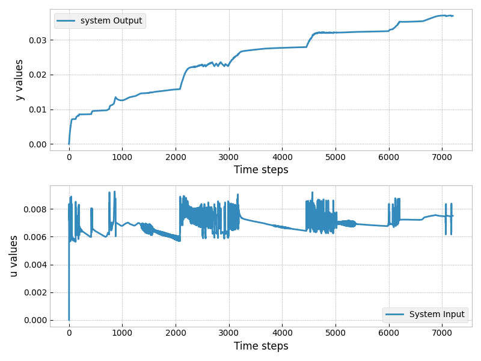

# Case Study: Pekilo Process

We would like to apply data-driven MPC to the Pekilo process, where the dynamics are completely unknown to us.

## Schematic

## data collection

## data-driven MPC results

